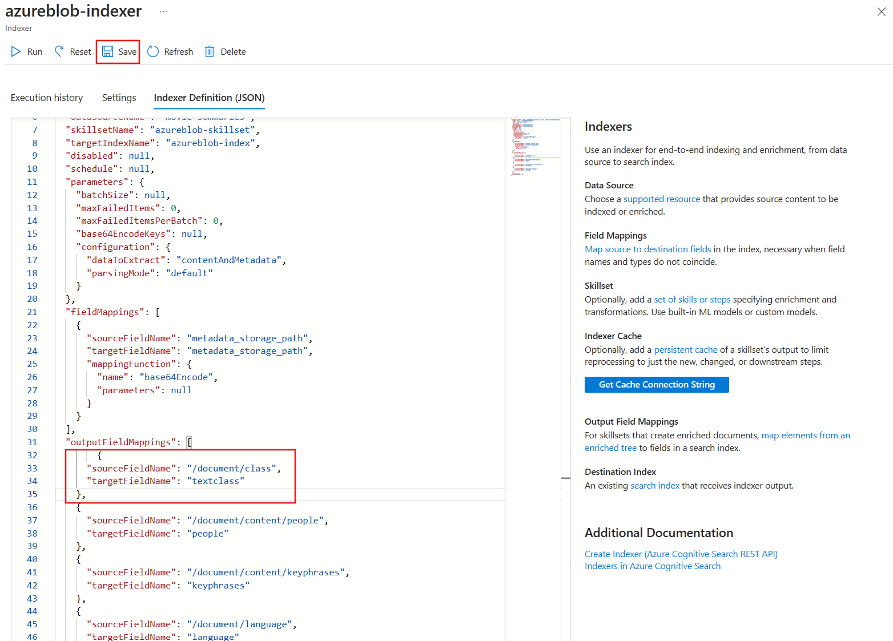
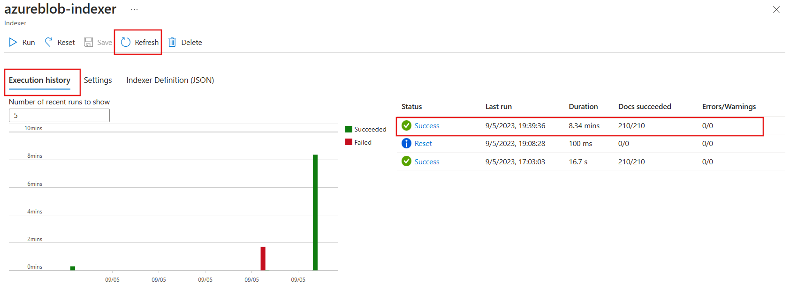

---
lab:
  title: إثراء فهرس بحث الذكاء الاصطناعي مع فئات مخصصة
---

# إثراء فهرس بحث الذكاء الاصطناعي مع فئات مخصصة

أنشئت حل بحث وتريد الآن إضافة خدمات الذكاء الاصطناعي في Azure لإثراء اللغة إلى الفهارس الخاصة بك.

في هذا التمرين، ستنشئ حل بحث الذكاء الاصطناعي في Azure وتثري الفهرس بالنتائج من مشروع تصنيف نص مخصص في Language Studio. ستقوم بإنشاء تطبيق وظائف لتوصيل نموذج البحث والتصنيف معاً.

> **ملاحظة**: لإكمال هذا التمرين، ستحتاج إلى اشتراك Microsoft Azure. إذا لم يكن لديك اشتراك بالفعل، يمكنك التسجيل للحصول على الإصدار التجريبي على [https://azure.com/free](https://azure.com/free?azure-portal=true) .

## إعداد بيئة التطوير الخاصة بك باستخدام ملحقات Python وVS Code

قم بتثبيت هذه الأدوات لإكمال هذا التمرين. لا يزال بإمكانك المتابعة مع الخطوات دون هذه الأدوات.

1. تثبيت [VS Code](https://code.visualstudio.com/)
1. تثبيت [Azure Core Functions Tool](https://github.com/Azure/azure-functions-core-tools)
1. تثبيت [ملحقات أدوات Azure لـ VSCode](https://code.visualstudio.com/docs/azure/extensions)
1. تثبيت [Python 3.8](https://www.python.org/downloads/release/python-380/) لنظام التشغيل الخاص بك.
1. تثبيت [ملحقات Python لـ VSCode](https://marketplace.visualstudio.com/items?itemName=ms-python.python)

## إعداد موارد Azure الخاص بك

لتوفير وقتك، حدد قالب Azure ARM هذا لإنشاء الموارد التي ستحتاجها لاحقاً في التمرين.

### توزيع قالب ARM تم إنشاؤه مسبقاً

1. [](https://portal.azure.com/#create/Microsoft.Template/uri/https%3A%2F%2Fraw.githubusercontent.com%2FMicrosoftLearning%2Fmslearn-knowledge-mining%2Fmain%2FLabfiles%2F04-enrich-custom-classes%2Fazuredeploy.json) تحديد هذا الارتباط لإنشاء موارد البداية. قد تحتاج إلى نسخ [الارتباط المباشر](https://portal.azure.com/#create/Microsoft.Template/uri/https%3A%2F%2Fraw.githubusercontent.com%2FMicrosoftLearning%2Fmslearn-knowledge-mining%2Fmain%2FLabfiles%2F04-enrich-custom-classes%2Fazuredeploy.json) ولصقه في شريط البحث.

    
1. في **Resource group**، حدد **Create new**، وبادر بتسميته **cog-search-language-exe**.
1. في **Region**، حدد [supported region](https://learn.microsoft.com/azure/ai-services/language-service/concepts/regional-support) القريبة من منطقتك.
1. يجب أن تكون **بادئة المورد** فريدة بشكل عام، أدخل بادئة حرف رقمية وأحرف صغيرة عشوائية، على سبيل المثال **acs18245**.
1. في **Location**، حدد نفس المنطقة التي اخترتها أعلاه.
1. حدد "**Review + create**".
1. حدد **إنشاء**.

    > **ملاحظة** يوجد خطأ موضح، **ستحتاج إلى الموافقة على شروط الخدمة أدناه لإنشاء هذا المورد بنجاح.**، بتحديد **إنشاء** فإنك توافق عليها.

1. حدد **Go to resource group** للاطلاع على جميع الموارد التي أنشأتها.

    
ستقوم بإعداد فهرس Azure Cognitive Search، وإنشاء دالة Azure، وإنشاء مشروع Language Studio لتحديد أنواع الأفلام من ملخصاتها.

### تحميل عينة من البيانات لتدريب خدمات اللغات

يستخدم هذا التمرين 210 ملفاً نصياً يحتوي على ملخص رسم لفيلم. اسم الملفات النصية هو عنوان الفيلم. يحتوي المجلد أيضاً على ملف **movieLabels.json** الذي يعين أنواع الفيلم إلى الملف، لكل ملف يوجد إدخال JSON مثل هذا:

```json
{
    "location": "And_Justice_for_All.txt",
    "language": "en-us",
    "classifiers": [
        {
            "classifierName": "Mystery"
        },
        {
            "classifierName": "Drama"
        },
        {
            "classifierName": "Thriller"
        },
        {
            "classifierName": "Comedy"
        }
    ]
},
```

1. انتقل إلى **Labfiles/04-enrich-custom-classes** واستخرج مجلد **movies summary.zip** الذي يحتوي على جميع الملفات.

    > **ملاحظة** يمكنك استخدام هذه الملفات لتدريب نموذج في Language Studio، كما ستقوم أيضًا بفهرسة جميع الملفات في بحث الذكاء الاصطناعي في Azure.

1. في [مدخل Azure](https://portal.azure.com/)، حدد **مجموعات الموارد** ثم حدد مجموعة الموارد.
1. حدد حساب التخزين الذي أنشأته، على سبيل المثال **acs18245str**.
1. حدد **التكوين** من الجزء الأيمن، وحدد خيار **تمكين** لإعداد *السماح بالوصول المجهول إلى الكائن الثنائي كبير الحجم* ثم حدد **حفظ** في أعلى الصفحة.

    

1. حدد **حاويات** من اليسار، ثم حدد **حاويات +**.
1. في جزء **New container** في **Name**، أدخل **language-studio-training-data**.
1. في **مستوى الوصول المجهول**، اختر **الحاوية (وصول مجهول للقراءة للحاويات والكائنات الثنائية الكبيرة)** وحدد **إنشاء**.
1. حدد الحاوية الجديدة التي قمت بإنشائها للتو، **language-studio-training-data**.
    
1. حدد **Upload** في أعلى الجزء.
1. في جزء **تحميل كائن ثنائي كبير الحجم** وحدد **استعراض للملفات**.
1. انتقل إلى المكان الذي استخرجت الملفات النموذجية فيه، وحدد جميع الملفات النصية (`.txt`) وjson (`.json`).
1. حدد **Upload** في الجزء.
1. أغلق الجزء **Upload blob**.

### إنشاء مورد اللغة

1. في ارتباط العناوين في أعلى الصفحة، حدد **الصفحة الرئيسية**.
1. حدد **+ إنشاء مورد** وابحث عن *خدمة اللغة*.
1. حدد **إنشاء** ضمن **خدمة اللغة**.
1. حدد الخيار الذي يتضمن **تصنيف النص المخصص والتعرّف على الكيانات المسماة المخصصة**.
1. حدد **Continue to create your resource**.
1. في **Resource group**، اختر **cog-search-language-exe**.
1. في **Region**، حدد المنطقة التي استخدمتها أعلاه.
1. في **Name**، أدخل **learn-language-service-for-custom-text**. يجب أن يكون هذا فريداً عالمياً، لذلك قد تحتاج إلى إضافة أرقام أو أحرف عشوائية في نهايتها.
1. في مستوى **Pricing**، حدد **S**.
1. في **New/Existing storage account**، حدد **Existing storage account**.
1. في **حساب التخزين في منطقة الاشتراك والموارد المحددة حالياً**، حدد حساب التخزين الذي قمت بإنشائه، على سبيل المثال **acs18245str**.
1. وافق على شروط **إشعار الذكاء الاصطناعي المسؤول**، ثم حدد **Review + create**.
1. حدد **إنشاء**.
1. انتظر حتى يتم توزيع الموارد، ثم حدد **Go to resource group**.
1. حدد **learn-language-service-for-custom-text**.

    
1. مرر لأسفل في جزء **Overview**، وحدد **Get started with Language Studio**.
1. سجل الدخول في language studio. إذا جرت مطالبتك باختيار مورد لغة، فحدد المورد الذي أنشأتها مسبقاً.

### إنشاء مشروع تصنيف نص مخصص في Language Studio

1. في الصفحة الرئيسية لـ Language Studio، حدد **Create new**، ثم حدد **Custom text classification**.

    

1. حدد **التالي**.

    
1. حدد **Multi label classification**، ثم حدد **Next**.

    

1. في **Name**، أدخل **movie-genre-classifier**.
1. في **Text primary language**، حدد **English (US)**.
1. في **Description**، أدخل **نموذجاً يمكنه تحديد نوع فيلم من الملخص**.
1. حدد **نعم، تمكين مجموعة البيانات متعددة اللغات**.
1. حدد **التالي**.

    

1. في **Blob storage container**، اختر **language-studio-training-data**.
1. حدد **نعم، تمت تسمية مستنداتي بالفعل ولدي ملف تسميات JSON منسق بشكل صحيح**.
1. في **Label documents**، اختر **movieLabels**.
1. حدد **التالي**.
1. حدد **إنشاء مشروع**

### تدريب نموذج الذكاء الاصطناعي لتصنيف النص المخصص الخاص بك

1. على اليسار، حدد **Training jobs**.

    

1. حدد **+ Start a training job**.

    
1. في **Train a new modal**، أدخل **movie-genre-classifier**.
1. حدد **تدريب**.
1. يجب أن يستغرق تدريب نموذج المصنف أقل من 10 دقائق. انتظر حتى تتغير الحالة إلى **نجح التدريب**.

### توزيع نموذج الذكاء الاصطناعي لتصنيف النص المخصص الخاص بك

1. على اليسار، حدد **Deploying a model**.

    
1. حدد **Add a deployment**.

    
1. في **Create a new deployment name**، أدخل **test-release**.
1. في **Model**، حدد **movie-genre-classifier**.
1. حدد **نشر**.

اترك صفحة الويب هذه مفتوحة لاحقاً في هذا التمرين.

### إنشاء فهرس كلمات بحث الذكاء الاصطناعي في Azure

أنشئ فهرس بحث يمكنك تحسينه باستخدام هذا النموذج، وستقوم بفهرسة جميع الملفات النصية التي تحتوي على ملخصات الأفلام التي قمت بتنزيلها بالفعل.

1. في [مدخل Azure](https://portal.azure.com/)، حدد **مجموعات الموارد**، وحدد مجموعة الموارد الخاصة بك، ثم حدد حساب التخزين الذي أنشأته على سبيل المثال **acs18245str**.
1. حدد **حاويات** من اليسار، ثم حدد **حاويات +**.
1. في جزء **New container** في **Name**، أدخل **search-data**.
1. في **مستوى الوصول المجهول**، اختر **الحاوية**.
1. حدد **إنشاء**.
1. حدد الحاوية الجديدة التي قمت بإنشائها للتو **search-data**.
1. حدد **Upload** في أعلى الجزء.
1. في جزء **تحميل كائن ثنائي كبير الحجم** وحدد **استعراض للملفات**.
1. انتقل إلى المكان الذي قمت بتنيل ملفات العينة فيه وحدد **ONLY** الملفات النصية (`.txt`).
1. حدد **Upload** في الجزء.
1. أغلق الجزء **Upload blob**.

### استيراد المستندات إلى بحث الذكاء الاصطناعي في Azure

1. على اليمين، حدد **مجموعات الموارد**، وحدد مجموعة الموارد الخاصة بك، ثم حدد خدمة البحث لديك.

1. حدد **Import data**.

    
1. في **Data Source**، حدد **Azure Blob Storage**.
1. في **Data source name**، أدخل **movie-summaries**.
1. حدد **اختيار اتصال موجود**، وحدد حساب التخزين الخاص بك، ثم حدد الحاوية التي أنشأتها للتو، **وبيانات البحث**.
1. حدد **أضف مهارات معرفية (اختياري)**.
1. يمكنك توسيع **قسم إرفاق خدمات الذكاء الاصطناعي** ثم حدد خدمة الذكاء الاصطناعي في Azure التي أنشأتها مسبقاً.

    
1. قم بتوسيع القسم **Add enrichments**.

    
1. اترك كافة الحقول بقيمها الافتراضية، ثم حدد **Extract people names**.
1. حدد **Extract key phrases**.
1. حدد **Detect language**.
1. حدد **Next: Customize target index**.

    
1. اترك كافة الحقول بقيمها الافتراضية للحقل **metadata_storage_name** حدد **Retrievable** و**Searchable**.
1. حدد **التالي: إنشاء مفهرس**.
1. حدد **إرسال**.

سيقوم المفهرس بتشغيل وإنشاء فهرس لـ 210 ملفاً نصياً. لا تحتاج إلى الانتظار حتى يستمر في الخطوات التالية.

## إنشاء تطبيق الوظائف لإثراء فهرس البحث الخاص بك

ستقوم الآن بإنشاء تطبيق وظائف Python الذي ستستدعيه مجموعة المهارات المخصصة للبحث المعرفي. سيستخدم تطبيق الوظائف نموذج مصنف النص المخصص لإثراء فهرس البحث الخاص بك.

1. يمكنك [تنزيل الملفات](https://github.com/MicrosoftLearning/mslearn-knowledge-mining/raw/main/Labfiles/04-enrich-custom-classes/movie-genre-function.zip) المطلوبة واستخراج المجلد الذي يحتوي على جميع الملفات.
1. افتح تعليمة Visual Studio البرمجية وافتح مجلد **movie-genre-function** الذي نزلته للتو.

    
1. إذا قمت بتثبيت جميع الملحقات المطلوبة، فستتم مطالبتك بتحسين المشروع. حدد **نعم**.
    
1. حدد مترجم Python الخاص بك، يجب أن يكون الإصدار 3.8.
1. سيتم تحديث مساحة العمل، إذا تمت مطالبتك بتوصيلها بمجلد مساحة العمل، فحدد **Yes**.
1. اضغط على **F5** لتتبع أخطاء التطبيق.

    
    إذا كان التطبيق قيد التشغيل، يجب أن تشاهد عنوان URL المضيف المحلي الذي يمكنك استخدامه للاختبار المحلي.

1. توقف عن تصحيح أخطاء التطبيق، واضغط على **SHIFT** + **F5**.

### توزيع تطبيق الوظائف المحلي إلى Azure

1. لفتح لوحة الأوامر في تعليمة Visual Studio البرمجية، اضغط على **F1**.
1. في لوحة الأوامر، ابحث عن `Azure Functions: Create Function App in Azure...` واختره.
1. قم بإدخال اسم فريد بشكل عمومي لتطبيق الوظائف الخاص بك على سبيل المثال **acs13245str-function-app**.
1. في **Select a runtime stack**، حدد **Python 3.8**.
1. حدد نفس الموقع الذي استخدمته سابقاً.

1. في جزء التنقل الأيسر، حدد الملحق **Azure**.
    
1. يمكنك توسيع **الموارد** وتوسيع **تطبيق الوظيفة** ضمن اشتراكك، ثم انقر بزر الماوس الأيمن على الوظيفة، على سبيل المثال **acs13245-function-app**.
1. حدد **Deploy to Function App**. انتظر حتى يتم توزيع التطبيق.
1. قم بتوسيع التطبيق، وانقر بزر الماوس الأيمن على **Application Settings**، ثم حدد **Download Remote Settings**.
1. على اليسار، حدد **Explorer**، ثم حدد **local.settings.json**.

    
يجب أن يكون تطبيق الوظائف متصلاً بنموذج تصنيف النص المخصص. اتبع هذه الخطوات للحصول على إعدادات التكوين.

1. في المستعرض، انتقل إلى **Language Studio**، يجب أن تكون على صفحة **Deploying a model**.

    
1. تحديد النموذج الخاص بك. ثم حدد **الحصول على عنوان URL للتنبؤ**.
1. حدد أيقونة «نسخ» بجوار **Prediction URL**.
1. في Visual Studio Code، في أسفل **local.settings.json**، الصق عنوان URL للتنبؤ.
1. في **Language Studio** على اليسار، حدد **Project settings**.

    
1. حدد أيقون «نسخ» بجوار **Primary key**.
1. في Visual Studio Code، في أسفل **local.settings.json**، الصق المفتاح الأساسي.
1. قم بتحرير الإعدادات لإضافة هذه الأسطر الأربعة في الأسفل، وانسخ نقطة النهاية إلى القيمة `TA_ENDPOINT`.

    ```json
    ,
    "TA_ENDPOINT": " [your endpoint] ",
    "TA_KEY": " [your key] ",
    "DEPLOYMENT": "test-release",
    "PROJECT_NAME": "movie-genre-classifier"
    ```

1. انسخ المفتاح الأساسي إلى القيمة `TA_KEY`.

    ```json
    {
      "IsEncrypted": false,
      "Values": {
        "AzureWebJobsStorage": "DefaultEndpointsProtocol=https;AccountName=...",
        "FUNCTIONS_EXTENSION_VERSION": "~4",
        "FUNCTIONS_WORKER_RUNTIME": "python",
        "WEBSITE_CONTENTAZUREFILECONNECTIONSTRING": "DefaultEndpointsProtocol=https;AccountName=...",
        "WEBSITE_CONTENTSHARE": "acs...",
        "APPINSIGHTS_INSTRUMENTATIONKEY": "6846...",
        "TA_ENDPOINT": "https://learn-languages-service-for-custom-text.cognitiveservices.azure.com/language/analyze-text/jobs?api-version=2022-05-01",
        "TA_KEY": "7105e938ce1...",
        "DEPLOYMENT": "test-release",
        "PROJECT_NAME": "movie-genre-classifier"
      }
    }

    ```

    يجب أن تبدو الإعدادات كما هو موضح أعلاه، مع قيم مشروعك.
 
1. اضغط على **CTRL**+**S** لحفظ التغييرات الخاصة بك**local.settings.json**.
1. في جزء التنقل الأيسر، حدد الملحق **Azure**.
1. يمكن توسيع **الموارد**، وضمن اشتراكك، يمكن توسيع **تطبيق الوظائف**، ثم انقر بزر الماوس الأيمن على **إعدادات التطبيق**، وحدد **تحميل الإعدادات المحلية **.

### اختبار تطبيق الوظائف عن بُعد

هناك نموذج استعلام يمكنك استخدامه لاختبار أن تطبيق الوظائف ونموذج المصنف يعملان بشكل صحيح.

1. على اليمين، حدد **مستكشف**، ووسع المجلد **customtectcla**، ثم حدد **sample.dat**.

    
1. نسخ محتويات هذا الملف.
1. على اليسار، حدد ملحق **Azure**.

    
1. ضمن **Function App**، قم بتوسيع **Functions**، وانقر بزر الماوس الأيمن على **customtextcla**، ثم حدد **Execute Function now**.
1. في **Enter request body**، الصق عينة البيانات التي قمت بنسخها، ثم اضغط على **Enter**.

    سيستجيب تطبيق الوظائف بنتائج JSON.

1. قم بتوسيع الإعلام لمشاهدة النتائج بأكملها.

    
    ينبغي أن تبدو الاستجابة كما يلي:

    ```json
    {"values": 
        [
            {"recordId": "0", 
            "data": {"text": 
            [
                {"category": "Action", "confidenceScore": 0.99}, 
                {"category": "Comedy", "confidenceScore": 0.96}
            ]}}
        ]
    }
    ```

### إضافة حقل إلى فهرس البحث الخاص بك

تحتاج إلى مكان لتخزين الإثراء الذي تم إرجاعه بواسطة تطبيق الوظائف الجديد. اتبع هذه الخطوات لإضافة حقل مركب جديد لتخزين تصنيف النص ودرجة الثقة.

1. في [مدخل Azure](https://portal.azure.com/)، انتقل إلى مجموعة الموارد التي تحتوي على خدمة البحث الخاصة بك، ثم حدد خدمة البحث المعرفي التي أنشأتها، على سبيل المثال، **acs18245-search-service**.
1. في جزء **Overview**، حدد **Indexes**.
1. حدد **azurebob-index**.
1. حدد **تحرير JSON**.
1. أضف الحقول الجديدة إلى الفهرس، والصق JSON أدناه ضمن حقل المحتوى.

    ```json
    {
      "name": "textclass",
      "type": "Collection(Edm.ComplexType)",
      "analyzer": null,
      "synonymMaps": [],
      "fields": [
        {
          "name": "category",
          "type": "Edm.String",
          "facetable": true,
          "filterable": true,
          "key": false,
          "retrievable": true,
          "searchable": true,
          "sortable": false,
          "analyzer": "standard.lucene",
          "indexAnalyzer": null,
          "searchAnalyzer": null,
          "synonymMaps": [],
          "fields": []
        },
        {
          "name": "confidenceScore",
          "type": "Edm.Double",
          "facetable": true,
          "filterable": true,
          "retrievable": true,
          "sortable": false,
          "analyzer": null,
          "indexAnalyzer": null,
          "searchAnalyzer": null,
          "synonymMaps": [],
          "fields": []
        }
      ]
    },
    ```

    يجب أن يبدو فهرسك على هذا النحو.

    
1. حدد **حفظ**.

### تحرير مجموعة المهارات المخصصة لاستدعاء تطبيق الوظائف الخاص بك

يحتاج فهرس البحث المعرفي إلى طريقة لملء هذه الحقول الجديدة. قم بتحرير مجموعة المهارات التي أنشأتها سابقاً لاستدعاء تطبيق الوظائف الخاص بك.

1. في أعلى الصفحة، حدد ارتباط خدمة البحث، على سبيل المثال **acs18245-search-service | فهارس**.

1. في جزء **Overview**، حدد **Skillsets**.

    
1. حدد **azureblob-skillset**.
1. أضف تعريف مجموعة المهارات المخصصة أدناه، عن طريق لصقه كمجموعة المهارات الأولى.

    ```json
    {
      "@odata.type": "#Microsoft.Skills.Custom.WebApiSkill",
      "name": "Genre Classification",
      "description": "Identify the genre of your movie from its summary",
      "context": "/document",
      "uri": "URI",
      "httpMethod": "POST",
      "timeout": "PT30S",
      "batchSize": 1,
      "degreeOfParallelism": 1,
      "inputs": [
        {
          "name": "lang",
          "source": "/document/language"
        },
        {
          "name": "text",
          "source": "/document/content"
        }
      ],
      "outputs": [
        {
          "name": "text",
          "targetName": "class"
        }
      ],
      "httpHeaders": {}
    },
    ```

تحتاج إلى تغيير `"uri": "URI"` للإشارة إلى تطبيق الوظائف الخاص بك.

1. في Visual Studio Code، حدد ملحق **Azure**.

    
1. ضمن **Functions**، انقر بزر الماوس الأيمن على **customtextcla**، ثم حدد **Copy Function Url**.
1. في مدخل Azure، استبدل URI بعنوان URL للوظيفة المنسوخة. 
1. حدد **حفظ**.

### تحرير تعيينات الحقول في المفهرس

لديك الآن حقول لتخزين الإثراء، ومجموعة المهارات لاستدعاء تطبيق الوظائف الخاص بك، والخطوة الأخيرة هي إخبار البحث المعرفي بمكان وضع الإثراء.

1. في أعلى الصفحة، حدد خدمة البحث، على سبيل المثال ارتباط **acs18245-search-service | مجموعات المهارات**.

    
1. في جزء **Overview**، حدد **Indexers**.
1. حدد **azureblob-indexer**.
1. حدد **Indexer Definition (JSON)**.
1. أضف تعيين حقل إخراج جديداً، عن طريق لصق تعريف الحقل هذا في أعلى قسم حقل الإخراج.

    ```json
    {
      "sourceFieldName": "/document/class",
      "targetFieldName": "textclass"
    },
    ```

    يجب أن يبدو تعريف JSON للمفهرس الآن كما يلي:

    
1. حدد **حفظ**.
1. حدد **Reset**، ثم حدد **Yes**.
1. حدد **Run**، ثم حدد **Yes**.

    تقوم خدمة البحث المعرفي من Azure بتشغيل المفهرس المحدث الخاص بك. يستخدم المفهرس مجموعة المهارات المخصصة المحررة. تستدعي مجموعة المهارات تطبيق الوظائف الخاص بك مع المستند الذي تتم فهرسته. يستخدم نموذج مصنف النص المخصص النص الموجود في المستند لمحاولة تحديد نوع الفيلم. يقوم النموذج بإرجاع مستند JSON مع الأنواع ومستويات الثقة. يقوم المفهرس بتعيين نتائج JSON إلى الحقول في الفهرس باستخدام تعيين حقل الإخراج الجديد.

1. حدد **Execution history**.
1. تحقق من تشغيل المفهرس بنجاح مقابل 210 مستندات.

    
    قد تحتاج إلى تحديد **Refresh** لتحديث حالة المفهرس.

## اختبار فهرس البحث الذي تم إثرائه الخاص بك

1. في أعلى الصفحة، حدد خدمة البحث، على سبيل المثال **acs18245-search-service | فهارس**.

1. في جزء **Overview**، حدد **Indexes**.
1. حدد **azurebob-index**.

    
1. حدد **بحث**.
1. استكشف نتائج البحث.

يجب أن يحتوي كل مستند في الفهرس على حقل `textclass` جديد يمكن البحث فيه. يحتوي على حقل فئة مع أنواع الأفلام. يمكن أن يكون أكثر من واحد. كما يوضح مدى ثقة نموذج تصنيف النص المخصص في النوع المحدد.

الآن بعد أن أكملت التمرين، احذف جميع الموارد التي لم تعد بحاجة إليها.

### حذف موارد التمرين

1. في مدخل Azure، انتقل إلى الصفحة الرئيسية، وحدد **مجموعات الموارد**.
1. حدد مجموعات الموارد التي لا تحتاج إليها، ثم حدد **حذف مجموعات الموارد**.
