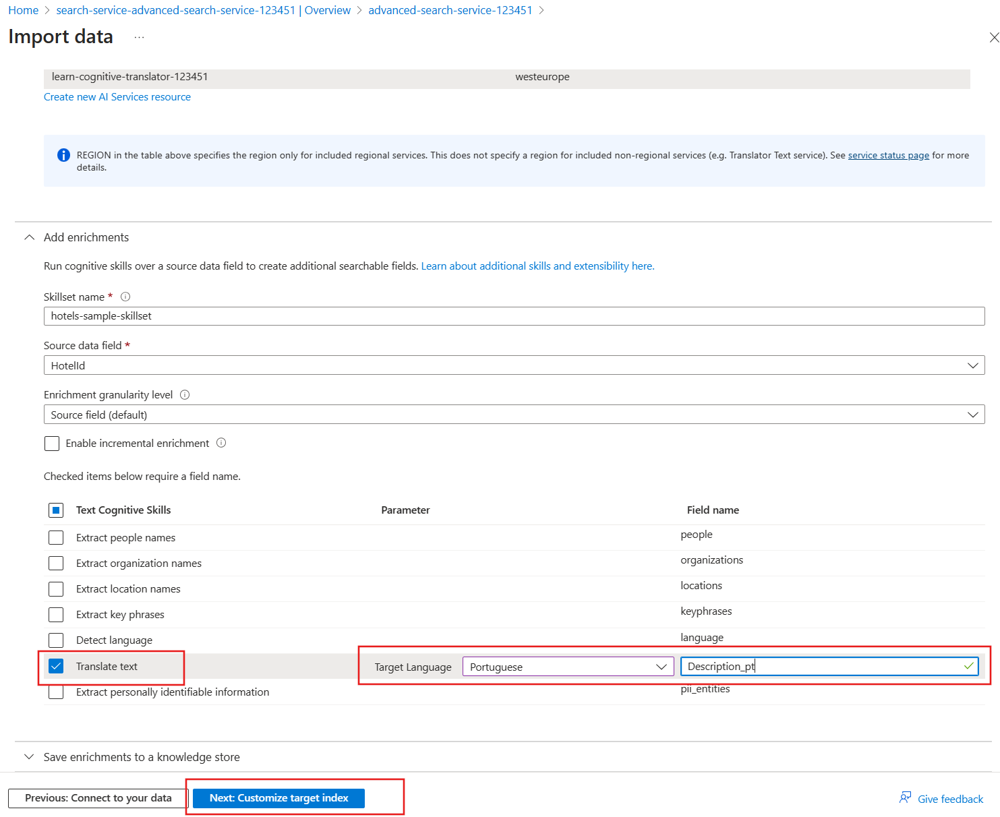

---
lab:
  title: تنفيذ التحسينات على نتائج البحث
---

# تنفيذ التحسينات على نتائج البحث

لديك خدمة بحث موجودة يستخدمها تطبيق حجز العطلات. رأيت أن أهمية نتائج البحث تؤثر على عدد الحجوزات التي تحصل عليها. أضفت مؤخراً فنادق في البرتغال لذلك ترغب في تقديم اللغة البرتغالية كلغة مدعومة.

في هذا التمرين، ستضيف ملف تعريف تسجيل النقاط لتحسين صلة نتائج البحث. ثم ستستخدم خدمات الذكاء الاصطناعي في Azure لإضافة أوصاف برتغالية لجميع فنادقك.

> **ملاحظة**: لإكمال هذا التمرين، ستحتاج إلى اشتراك Microsoft Azure. إذا لم يكن لديك اشتراك بالفعل، يمكنك التسجيل للحصول على الإصدار التجريبي على [https://azure.com/free](https://azure.com/free?azure-portal=true) .

## إنشاء موارد Azure

ستنشئ خدمة بحث الذكاء الاصطناعي في Azure واستيراد عينة من بيانات الفندق.

1. قم بتسجيل الدخول إلى [بوابة Azure](https://portal.azure.com/learn.docs.microsoft.com?azure-portal=true).
1. حدد **+ Create a resource**.
1. فتش عن **البحث**، ثم حدد **بحث الذكاء الاصطناعي في Azure**.
1. حدد **إنشاء**.
1. حدد **إنشاء جديد** ضمن مجموعة الموارد، ويمكنك تسميته **Learn-advanced-search**.
1. في **اسم الخدمة**، أدخل **advanced-search-service-12345**. يجب أن يكون الاسم فريداً عالمياً، لذا أضف أرقاماً عشوائية إلى نهاية الاسم.
1. حدد منطقة مدعومة بالقرب منك.
1. استخدم القيم الافتراضية **لطبقة التسعير**.
1. حدد "**Review + create**".
1. حدد **إنشاء**.
1. انتظر حتى يتم توزيع الموارد، ثم حدد **Go to resource**.

### استيراد بيانات نموذجية إلى خدمة البحث

استيراد بيانات العينة.

1. ثم، في جزء **Overview** حدد **Import data**.

    
1. في جزء **استيراد البيانات**، داخل **مصدر البيانات**، حدد **العينات**.
1. حدد **hotels-sample**.

1. في علامة التبويب **إضافة مهارات معرفية (اختياري)**، عليك توسيع **إرفاق خدمات الذكاء الاصطناعي**، ثم حدد **إنشاء مورد خدمات الذكاء الاصطناعي الجديد**.

    

### إنشاء خدمة الذكاء الاصطناعي في Azure لدعم الترجمات

1. في علامة تبويب جديدة، سجل الدخول إلى مدخل Azure.
1. في **مجموعة الموارد**، حدد **learn-advanced-search**.
1. في **المنطقة**، حدد المنطقة نفسها التي اخترتها لخدمة البحث.
1. في **الاسم**، أدخل **learn-cognitive-translator-12345** أو أي اسم تفضله. يجب أن يكون الاسم فريداً عالمياً، لذا أضف أرقاماً عشوائية إلى نهاية الاسم.
1. في **طبقة التسعير**، حدد **معيار S0**.
1. حدد **. من خلال تحديد هذا المربع، أقر بأنني قرأت وفهمت جميع الشروط أدناه**.
1. حدد "**Review + create**".
1. حدد **إنشاء**.
1. عند إنشاء الموارد، أغلق علامة التبويب.

### إضافة إثراء الترجمة

1. في علامة التبويب **إضافة المهارات المعرفية (اختياري)،** حدد تحديث.
1. حدد الخدمة الجديدة، **learn-cognitive-translator-12345**.
1. قم بتوسيع القسم **Add enrichments**.
    
1. حدد **ترجمة النص**، وغير **اللغة الهدف** إلى **البرتغالية**، ثم غير **اسم الحقل** إلى **Description_pt**.
1. حدد **Next: Customize target index**.

### تغيير الحقل لتخزين النص المترجم

1. في علامة التبويب **تخصيص الفهرس الهدف**، عليك التمرير إلى أسفل قائمة الحقول وتغيير **المحلل** إلى **البرتغالية (البرتغال) - Microsoft** للحقل **Description_pt**.
1. حدد **التالي: إنشاء مفهرس**.
1. حدد **إرسال**.

    يجري إنشاء الفهرس، وسيعمل المفهرس، وسيجري استيراد 50 مستنداً تحتوي على نموذج بيانات الفندق.
1. في جزء **نظرة عامة**، حدد **الفهارس**، ثم حدد **hotels-sample-index**.
1. حدد **بحث** لمشاهدة JSON لكافة المستندات في الفهرس.
1. ابحث **عن Description_pt** (يمكنك استخدام **CTRL + F** لهذا) في النتائج ولاحظ أنها ليست ترجمة برتغالية للوصف باللغة الإنجليزية، ولكنها تبدو كما يلي بدلاً من ذلك:

    ```json
    "Description_pt": "45",
    ```

يفترض مدخل Microsoft Azure أن الحقل الأول في المستند يحتاج إلى الترجمة. لذلك فهي تستخدم حالياً مهارة الترجمة لترجمة `HotelId`.

### تحديث مجموعة المهارات لترجمة الحقل الصحيح في المستند

1. في أعلى الصفحة، اختر خدمة البحث، ارتباط **advanced-search-service-12345 | الفهارس**.
1. حدد **مجموعات المهارات** ضمن إدارة البحث في الجزء الأيمن، ثم حدد **hotels-sample-skillset**.
1. تحرير مستند JSON، وتغيير السطر 11 إلى:

    ```json
    "context": "/document/Description",
    ```

1. يمكنك تغيير الإعداد الافتراضي من اللغة إلى الإنجليزية في السطر 12:

    ```json
    "defaultFromLanguageCode": "en",
    ```

1. تغيير الحقل المصدر في السطر 18 إلى:

    ```json
    "source": "/document/Description"
    ```

1. حدد **حفظ**.
1. في أعلى الصفحة، اختر خدمة البحث، ارتباط **advanced-search-service-12345 | مجموعات المهارات**.
1. في جزء **نظرة عامة**، حدد **المفهرسات**، ثم حدد **hotels-sample-indexer**.
1. حدد **Indexer Definition (JSON)**.
1. تغيير اسم الحقل المصدر في السطر 21 إلى:

    ```json
    "sourceFieldName": "/document/Description/Description_pt",
    ```

1. حدد **حفظ**.
1. حدد **إعادة تعيين**، ثم حدد **نعم**.
1. حدد **تشغيل**، ثم حدد **نعم**.

### اختبار الفهرس المحدث

1. في أعلى الصفحة، اختر خدمة البحث، ارتباط **advanced-search-service-12345 | المفهرسات**.
1. في جزء **نظرة عامة**، حدد **الفهارس**، ثم حدد **hotels-sample-index**.
1. حدد **بحث** لمشاهدة JSON لكافة المستندات في الفهرس.
1. ابحث عن **Description_pt** في النتائج ولاحظ أن هناك الآن وصفاً برتغالياً.

    ```json
    "Description_pt": "O maior resort durante todo o ano da área oferecendo mais de tudo para suas férias – pelo melhor valor!  O que você pode desfrutar enquanto estiver no resort, além das praias de areia de 1,5 km do lago? Confira nossas atividades com certeza para excitar tanto os jovens quanto os jovens hóspedes do coração. Temos tudo, incluindo ser chamado de \"Propriedade do Ano\" e um \"Top Ten Resort\" pelas principais publicações.",
    ```

1. الآن عليك البحث عن الفنادق التي لديها إطلالات على البحيرات. سنبدأ باستخدام بحث بسيط يرجع فقط `HotelName`و`Description` و`Category` و`Tags`. في **سلسلة الاستعلام**، أدخل هذا البحث:

    `lake + view&$select=HotelName,Description,Category,Tags&$count=true`

    ابحث عن النتائج وحاول العثور على الحقول التي تطابق مصطلحي البحث `lake` و`view`. لاحظ هذا الفندق وموقعه:

    ```json
    {
      "@search.score": 0.9433406,
      "HotelName": "Lady Of The Lake B & B",
      "Description": "Nature is Home on the beach.  Save up to 30 percent. Valid Now through the end of the year. Restrictions and blackout may apply.",
      "Category": "Luxury",
      "Tags": [
        "laundry service",
        "concierge",
        "view"
      ]
    },
    ```

تطابق هذا الفندق مع بحيرة المصطلحات في حقل `HotelName` وفي المنظر في حقل `Tags`. ترغب في تعزيز تطابق الشروط في حقل `Description` على اسم الفندق. من الناحية المثالية، يجب أن يكون هذا الفندق الأخير في النتائج.

## إضافة ملف تعريف تسجيل النقاط لتحسين نتائج البحث

1. حدد علامة التبويب **ملفات تعريف تسجيل النقاط**.
1. حدد **+ إضافة ملف تعريف تسجيل النقاط**.
1. في **اسم ملف التعريف**، أدخل **boost-description-categories**.
1. أضف الحقول والأوزان التالية ضمن **الأوزان**:

    
1. في **اسم الحقل**، حدد **الوصف**.
1. بالنسبة **للوزن**، أدخل **5**.
1. في **اسم الحقل**، حدد **الفئة**.
1. بالنسبة **للوزن**، أدخل **3**.
1. في **اسم الحقل**، حدد **علامات**.
1. بالنسبة **للوزن**، أدخل **2**.
1. حدد **حفظ**.
1. حدد ⁧**⁩حفظ⁧**⁩ في الأعلى.

### اختبار الفهرس المحدث

1. ارجع إلى علامة تبويب **مستكشف البحث** في صفحة **hotels-sample-index**.
1. في **سلسلة الاستعلام**، أدخل البحث نفسه كما كان من قبل:

    `lake + view&$select=HotelName,Description,Category,Tags&$count=true`

    تحقق من نتائج البحث.

    ```json
    {
      "@search.score": 3.5707965,
      "HotelName": "Lady Of The Lake B & B",
      "Description": "Nature is Home on the beach.  Save up to 30 percent. Valid Now through the end of the year. Restrictions and blackout may apply.",
      "Category": "Luxury",
      "Tags": [
        "laundry service",
        "concierge",
        "view"
      ]
    }
    ```

    زادت درجة البحث من **0.9433406** إلى **3.5707965**. مع ذلك، فإن جميع الفنادق الأخرى لديها درجات محسوبة أعلى. هذا الفندق هو الآن الآخر في النتائج.

## حذف موارد التمرين

الآن بعد أن أكملت التمرين، احذف جميع الموارد التي لم تعد بحاجة إليها.

1. في مدخل Azure، حدد **مجموعات الموارد**:
1. حدد مجموعة الموارد التي لا تحتاج إليها بعد الآن، ثم حدد **حذف مجموعات الموارد**.
