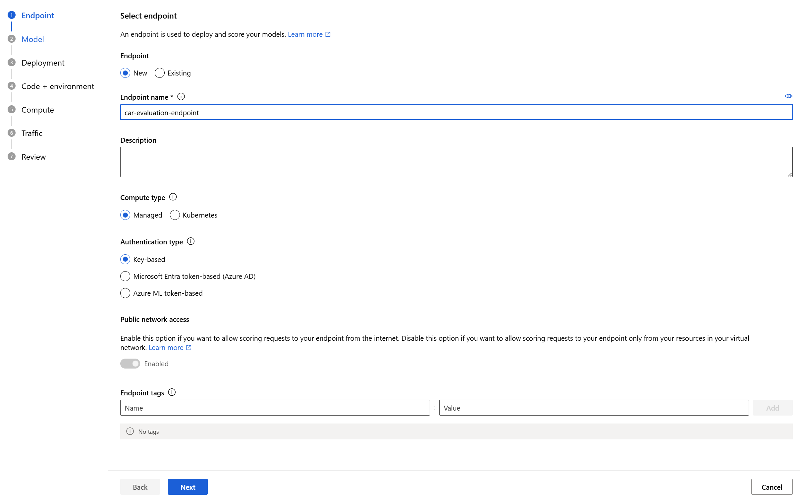

---
lab:
  title: إثراء فهرس بحث باستخدام نموذج التعلم الآلي من Azure
---

# إثراء فهرس بحث باستخدام نموذج التعلم الآلي من Azure

يمكنك استخدام قوة التعلم الآلي لإثراء فهرس البحث. لإجراء ذلك، ستستخدم نموذجاً مُدرباً في استوديو التعلم الآلي للذكاء الاصطناعي في Azure وتستدعيه من مجموعة مهارات مُخصَّصة للتعلم الآلي.

في هذا التمرين، ستنشئ نموذج Azure AI Machine Learning Studio، ثم عليك تدريب نقطة نهاية ونشرها واختبارها باستخدام النموذج. بعد ذلك، ستنشئ خدمة البحث المعرفي في Azure وبيانات نموذجية، وتثري فهرس باستخدام نقطة نهاية Azure AI Machine Learning studio.

> **ملاحظة**: لإكمال هذا التمرين، ستحتاج إلى اشتراك Microsoft Azure. إذا لم يكن لديك اشتراك بالفعل، يمكنك التسجيل للحصول على الإصدار التجريبي على [https://azure.com/free](https://azure.com/free?azure-portal=true) .
>

## إنشاء مساحة عمل "التعلم الآلي من Azure"

قبل أن تثري فهرس البحث خاصتك، بادر بإنشاء مساحة عمل التعلم الآلي من Azure. ستمنحك مساحة العمل إمكانية الوصول إلى Azure AI Machine Learning studio، وهو أداة رسومية يمكنك استخدامها لإنشاء نماذج الذكاء الاصطناعي ونشرها للاستخدام.

1. قم بتسجيل الدخول إلى [مدخل Azure](https://portal.azure.com).
1. حدد **+ Create a resource**.
1. ابحث عن التعلم الآلي، ثم حدد **Azure Machine Learning**.
1. حدد **إنشاء**.
1. حدد **إنشاء جديد** ضمن **مجموعة الموارد** وعليك تسميتها **aml-for-acs-enrichment**.
1. في قسم تفاصيل مساحة العمل، بالنسبة **للاسم**، أدخل **aml-for-acs-workspace**.
1. حدد **منطقة** مدعومة بالقرب منك.
1. استخدم القيم الافتراضية **لحساب التخزين**، **ومخزن المفاتيح**، **ونتائج تحليلات التطبيقات**، **وتسجيل الحاوية**.
1. حدد "**Review + create**".
1. حدد **إنشاء**.
1. انتظر حتى يتم توزيع مساحة عمل التعلم الآلي من Azure، ثم حدد **Go to resource**.
1. في الجزء "Overview"، حدد **Launch studio**.

## إنشاء البنية الأساسية لبرنامج ربط العمليات التجارية الخاصة بتدريب التراجع

ستنشئ الآن نموذج انحدار وتدربه باستخدام مسار Azure AI Machine Learning Studio. ستدرب نموذجك على بيانات أسعار السيارات. سيتنبأ النموذج بمجرد تدريبه بسعر السيارة بناء على سماتها.

1. في الصفحة الرئيسية، حدد **Designer**.

1. من قائمة المكونات التي تم إنشاؤها مسبقاً، حدد **Regression - Automobile Price Prediction (Basic)**.

    

1. حدد **التحقق من الصحة**.

1. في جزء **التحقق من صحة الرسم البياني**، حدد الخطأ **تحديد هدف الحساب في معالج الإرسال**.

    
1. في القائمة المنسدلة **تحديد نوع الحوسبة**، اختر **حساب المثيل**. ثم حدد **إنشاء مثيل حساب Azure ML** بالأسفل.
1. في حقل **اسم الحوسبة**، أدخل اسماً فريداً (مثل **حساب للتدريب**).
1. حدد **Review + create**، ثم حدد **Create**.

1. في الحقل **تحديد مثيل حساب Azure ML**، حدد المثيل الخاص بك من القائمة المنسدلة. قد تحتاج إلى الانتظار حتى ينتهي من التوفير.

1. حدد **التحقق من الصحة** مرة أخرى، يجب أن يبدو تدفقات المبيعات جيداً.

    
1. حدد **الأساسيات** في **جزء إعداد تدفقات المبيعات**.
1. حدد **إنشاء جديد** تحت اسم التجربة.
1. في **New experiment name**، أدخِل **linear-regression-training**.
1. حدد **مراجعة + إرسال**، ثم حدد **إرسال**.

### إنشاء نظام مجموعة استدلال لنقطة النهاية

بينما تدرب بنيتك الأساسية لبرنامج ربط العمليات التجارية نموذج التراجع الخطي، يمكنك إنشاء الموارد التي تحتاج إليها لنقطة النهاية. تحتاج نقطة النهاية هذه إلى نظام مجموعة Kubernetes لمعالجة طلبات الويب إلى نموذجك الخاص.

1. على اليسار، حدد **حساب**.

    
1. حدد **مجموعات Kubernetes**، ثم حدد **+ جديد**.
1. في القائمة المنسدلة، حدد **AksCompute**.
1. في جزء **إنشاء AksCompute**، حدد **إنشاء مجلد جديد**.
1. بالنسبة **للمنطقة**، حدد نفس المنطقة التي استخدمتها لإنشاء مواردك الأخرى.
1. في قائمة أحجام الأجهزة الظاهرية، حدد **Standard_A2_v2**.
1. حدد **التالي**.
1. في **Compute name**، أدخل **aml-acs-endpoint**.
1. حدد **Enable SSL configuration**.
1. في **Leaf domain**، أدخِل **aml-for-acs**.
1. حدد **إنشاء**.

### تسجيل نموذجك المُدرَّب

يجب أن تكون مهمة البنية الأساسية لبرنامج ربط العمليات التجارية خاصتك قد انتهت. ستنزل الملفين `score.py` و`conda_env.yaml`. ثم ستسجل نموذجك المُدرب.

1. على اليمين، حدد **المهام**.

    
1. حدد تجربتك، ثم حدد مهمتك المكتملة في الجدول، على سبيل المثال، **الانحدار - التنبؤ بسعر السيارة (أساسي)**. إذا جرت مطالبتك بحفظ التغييرات، فحدد **تجاهل** للتغييرات.
1. في المصمم، حدد **نظرة عامة** على الوظيفة في الجزء العلوي الأيسر، ثم حدد عقدة **نموذج القطار**.

    
1. في علامة تبويب **المخرجات + السجلات**، وسع المجلد **trained_model_outputs**.
1. بجوار `score.py`، حدد قائمة المزيد (**...**)، ثم حدد **تنزيل**.
1. بجوار `conda_env.yaml`، حدد قائمة المزيد (**...**)، ثم حدد **تنزيل**.
1. حدد **+ نموذج التسجيل** في أعلى علامة التبويب.
1. في حقل **مخرجات المهمة**، حدد المجلد **trained_model_outputs**. حدد **التالي** في أسفل الجزء.
1. بالنسبة إلى **اسم** النموذج، أدخل **Carevalmodel**.
1. في **الوصف**، أدخل **نموذج الانحدار الخطي للتنبؤ بأسعار السيارات.**.
1. حدد **التالي**.
1. حدد **تسجيل**.

### يمكنك تحرير البرنامج النصي للتسجيل للرد على بحث الذكاء الاصطناعي في Azure بشكل صحيح

نزل Azure Machine Learning Studio ملفين إلى موقع التنزيل الافتراضي لمستعرض الويب الخاص بك. تحتاج إلى تحرير ملف score.py لتغيير كيفية معالجة طلب JSON والاستجابة له. يمكنك استخدام محرر نصوص أو محرر تعليمات برمجية مثل Visual Studio Code.

1. في محررك، افتح ملف score.py.
1. استبدل جميع محتويات دالة التشغيل:

    ```python
    def run(data):
    data = json.loads(data)
    input_entry = defaultdict(list)
    for row in data:
        for key, val in row.items():
            input_entry[key].append(decode_nan(val))

    data_frame_directory = create_dfd_from_dict(input_entry, schema_data)
    score_module = ScoreModelModule()
    result, = score_module.run(
        learner=model,
        test_data=DataTable.from_dfd(data_frame_directory),
        append_or_result_only=True)
    return json.dumps({"result": result.data_frame.values.tolist()})
    ```

    باستخدام التعليمة البرمجية Python هذا:

    ```python
    def run(data):
        data = json.loads(data)
        input_entry = defaultdict(list)
        
        for key, val in data.items():
                input_entry[key].append(decode_nan(val))
    
        data_frame_directory = create_dfd_from_dict(input_entry, schema_data)
        score_module = ScoreModelModule()
        result, = score_module.run(
            learner=model,
            test_data=DataTable.from_dfd(data_frame_directory),
            append_or_result_only=True)
        output = result.data_frame.values.tolist()
        
        return {
                "predicted_price": output[0][-1]
        }    
    ```

    تسمح التغييرات أعلاه للوضع باستلام عنصر JSON واحد مع سمات السيارة بدلاً من صفيف من السيارات.

    التغيير الآخر هو إرجاع السعر المتوقع للسيارة فقط بدلاً من استجابة JSON بأكملها.
1. احفظ التغييرات في محرر النص خاصتك.

## إنشاء بيئة مخصصة

بعد ذلك، ستنشئ بيئة مخصصة حتى تتمكن من النشر إلى نقطة نهاية في الوقت الفعلي.

1. حدد **البيئات‏‎** في جزء التنقل.
1. حدد علامة التبويب **بيئات مخصصة**.
1. حدد **+ إنشاء**.
1. بالنسبة **للاسم**، أدخل **my-custom-environment**.
1. في قائمة *البيئات المنسقة* ضمن **تحديد نوع البيئة**، حدد أحدث إصدار من **automl-gpu**.
1. حدد **التالي**.
1. على جهازك المحلي، افتح ملف `conda_env.yaml` الذي نزلته مسبقاً وانسخ محتوياته.
1. ارجع إلى المستعرض، وحدد **conda_dependencies.yaml** في جزء تخصيص.
1. في الجزء الموجود على اليمين، استبدل محتوياته بالتعليمات البرمجية التي نسختها سابقاً.
1. حدد **التالي**، ثم حدد **التالي** مرة أخرى.
1. حدد **إنشاء** لإنشاء بيئتك المخصصة.

## توزيع النموذج باستخدام التعليمات البرمجية المُحدَّثة لتسجيل النقاط <!--Option for web service deployment is greyed out. Can't go further after trying several different things.-->

يجب أن يكون نظام مجموعة الاستدلال خاصتك جاهزاً للاستخدام الآن. لقد حررت أيضاً التعليمات البرمجية الخاصة بتسجيل النقاط لمعالجة الطلبات من مجموعة المهارات المخصصة لـ Azure Cognitive Search. لننشئ نقطة نهاية للنموذج ونختبرها.

1. على اليسار، حدد **Models**.
1. حدد النموذج الذي سجلته، **carevalmodel**.

1. حدد **نشر**، ثم حدد **نقطة نهاية الوقت الفعلي**.

    
1. بالنسبة **للاسم**، أدخل اسماً فريداً، على سبيل المثال **car-evaluation-endpoint-1440637584**.
1. بالنسبة إلى **نوع الحوسبة**، حدد **المدارة**.
1. بالنسبة **لنوع المصادقة**، حدد **المصادقة المستندة إلى المفتاح**.
1. حدد **التالي**، ثم حدد **التالي**.
1. حدد **التالي** مرة أخرى.
1. في الحقل **تحديد برنامج نصي للتسجيل للاستدلال**، استعرض وصولاً إلى الملف المحدث `score.py` لديك وحدده.
1. في القائمة المنسدلة **تحديد نوع البيئة**، حدد **البيئات المخصصة**.
1. حدد خانة الاختيار على البيئة المخصصة من القائمة.
1. حدد **التالي**.
1. بالنسبة للجهاز الظاهري، حدد **Standard_D2as_v4**.
1. تعيين **عدد المثيلات** إلى **1**.
1. حدد **التالي**، ثم حدد **التالي** مرة أخرى.
1. حدد **إنشاء**.

انتظر حتى توزيع النموذج، فقد يستغرق الأمر ما يصل إلى 10 دقائق. يمكنك التحقق من الحالة في قسم **الإشعارات** أو نقاط النهاية في Azure Machine Learning Studio.

### اختبار نقطة نهاية النموذج المُدرَّب خاصتك

1. على اليمين، حدد **نقاط النهاية**.
1. حدد **car-evaluation-endpoint**.
1. حدد **اختبار**، في **إدخال البيانات لاختبار نقطة النهاية**، الصق هذا المثال JSON.

    ```json
    {
        "symboling": 2,
        "make": "mitsubishi",
        "fuel-type": "gas",
        "aspiration": "std",
        "num-of-doors": "two",
        "body-style": "hatchback",
        "drive-wheels": "fwd",
        "engine-location": "front",
        "wheel-base": 93.7,
        "length": 157.3,
        "width": 64.4,
        "height": 50.8,
        "curb-weight": 1944,
        "engine-type": "ohc",
        "num-of-cylinders": "four",
        "engine-size": 92,
        "fuel-system": "2bbl",
        "bore": 2.97,
        "stroke": 3.23,
        "compression-ratio": 9.4,
        "horsepower": 68.0,
        "peak-rpm": 5500.0,
        "city-mpg": 31,
        "highway-mpg": 38,
        "price": 0.0
    }
    ```

1. حدد **اختبار**، وينبغي أن تشاهد استجابة:

    ```json
    {
        "predicted_price": 5852.823214312815
    }
    ```

1. حدد **Consume**.

    
1. انسخ **REST endpoint**.
1. انسخ **Primary key**.

### دمج نموذج Azure Machine Learning مع بحث الذكاء الاصطناعي في Azure

بعد ذلك، يمكنك إنشاء خدمة بحث معرفي جديدة وإثراء الفهرس باستخدام مجموعة مهارات مخصصة.

### إنشاء ملف اختبار

1. في [مدخل Azure](https://portal.azure.com/learn.docs.microsoft.com?azure-portal=true)، حدد "Resource groups".
1. حدد **aml-for-acs-enrichment**.

    
1. حدد حساب التخزين، على سبيل المثال **amlforacsworks1440637584**.
1. حدد **تكوين** ضمن **الإعدادات**. ثم عليك تعيين **السماح بالوصول المجهول للكائن ثنائي كبير الحجم** إلى **نجح التمكين**.
1. حدد **حفظ**.
1. ضمن **Data storage**، حدد **Containers**. 
1. أنشئ حاوية جديدة لتخزين بيانات الفهرس، وحدد **+ Container**.
1. في الجزء **New container** في **Name**، أدخِل **docs-to-search**.
1. في **مستوى الوصول المجهول**، حدد **الحاوية (وصول مجهول للقراءة للحاويات والوحدات الثنائية الكبيرة)**.
1. حدد **إنشاء**.
1. حدد حاوية **docs-to-search** التي أنشأتها.
1. في محرر النص، أنشئ مستند JSON:

    ```json
    {
      "symboling": 0,
      "make": "toyota",
      "fueltype": "gas",
      "aspiration": "std",
      "numdoors": "four",
      "bodystyle": "wagon",
      "drivewheels": "fwd",
      "enginelocation": "front",
      "wheelbase": 95.7,
      "length": 169.7,
      "width": 63.6,
      "height": 59.1,
      "curbweight": 2280,
      "enginetype": "ohc",
      "numcylinders": "four",
      "enginesize": 92,
      "fuelsystem": "2bbl",
      "bore": 3.05,
      "stroke": 3.03,
      "compressionratio": 9.0,
      "horsepower": 62.0,
      "peakrpm": 4800.0,
      "citympg": 31,
      "highwaympg": 37,
      "price": 0
    }
    ```

    احفظ المستند إلى جهازك كملحق `test-car.json`.
1. في المدخل، حدد **Upload**.
1. في جزء **تحميل كائن ثنائي كبير الحجم**، حدد **مستعرضات الملفات**، وانتقل إلى المكان الذي حفظت فيه مستند JSON، ثم حدده.
1. حدد **تحميل**.

### إنشاء مورد كلام الذكاء الاصطناعي في Azure

1. في مدخل Azure، في الصفحة الرئيسية، حدد **+ إنشاء مورد**.
1. ابحث عن **بحث الذكاء الاصطناعي في Azure** ثم حدد **بحث الذكاء الاصطناعي في Azure**.
1. حدد **إنشاء**.
1. في **Resource Group**، حدد **aml-for-acs-enrichment**.
1. في اسم الخدمة، أدخل اسماً فريداً، على سبيل المثال **acs-enriched-1440637584**.
1. بالنسبة إلى **الموقع**، حدد المنطقة نفسها التي استخدمتها سابقاً.
1. حدد **Review + create**، ثم حدد **Create**.
1. انتظر حتى يتم توزيع الموارد، ثم حدد **Go to resource**.
1. حدد **Import data**.
1. في جزء **الاتصال ببياناتك**، بالنسبة لحقل **مصدر البيانات**، حدد **Azure Blob Storage**.
1. في **اسم مصدر البيانات**، حدد **import-docs**.
1. في **Parsing mode**، حدد **JSON**.
1. في **Connection string**: حدد **Choose an existing connection**.
1. حدد حساب التخزين الذي حملت إليه، على سبيل المثال، **amlforacsworks1440637584**.
1. في الجزء **Containers**، حدد **docs-to-search**. 
1. حدد **تحديد**.
1. حدد **Next: Add cognitive skills (Optional)**.

### إضافة مهارات معرفية

1. بادر بتوسيع **Add enrichments**، ثم حدد **Extract people names**.
1. حدد **Next: Customize target index**.
1. حدد **+ إضافة حقل**، وفي **اسم الحقل**، أدخل **predicted_price** في أسفل القائمة.
1. في **النوع**، حدد **Edm.Double** للإدخال الجديد.
1. حدد **Retrievable** لجميع الحقول.
1. حدد **قابل للبحث** **للإعداد**.
1. حدد **التالي: إنشاء مفهرس**.
1. حدد **إرسال**.

## إضافة AML Skill إلى مجموعة المهارات

ستحل الآن محل إثراء أسماء الأشخاص مجموعة المهارات المُخصصة من Azure Machine Learning.

1. في جزء النظرة العامة، حدد **مجموعات المهارات** ضمن **إدارة البحث**.
1. ضمن **Name**، حدد **azureblob-skillset**.
1. استخدم JSON هذا بدلاً من تعريف المهارات لـ `EntityRecognitionSkill`، تذكر استبدال نقطة النهاية وقيم المفتاح الأساسي المنسوخين لديك:

    ```json
    "@odata.type": "#Microsoft.Skills.Custom.AmlSkill",
    "name": "AMLenricher",
    "description": "AML studio enrichment example",
    "context": "/document",
    "uri": "PASTE YOUR AML ENDPOINT HERE",
    "key": "PASTE YOUR PRIMARY KEY HERE",
    "resourceId": null,
    "region": null,
    "timeout": "PT30S",
    "degreeOfParallelism": 1,
    "inputs": [
      {
        "name": "symboling",
        "source": "/document/symboling"
      },
      {
        "name": "make",
        "source": "/document/make"
      },
      {
        "name": "fuel-type",
        "source": "/document/fueltype"
      },
      {
        "name": "aspiration",
        "source": "/document/aspiration"
      },
      {
        "name": "num-of-doors",
        "source": "/document/numdoors"
      },
      {
        "name": "body-style",
        "source": "/document/bodystyle"
      },
      {
        "name": "drive-wheels",
        "source": "/document/drivewheels"
      },
      {
        "name": "engine-location",
        "source": "/document/enginelocation"
      },
      {
        "name": "wheel-base",
        "source": "/document/wheelbase"
      },
      {
        "name": "length",
        "source": "/document/length"
      },
      {
        "name": "width",
        "source": "/document/width"
      },
      {
        "name": "height",
        "source": "/document/height"
      },
      {
        "name": "curb-weight",
        "source": "/document/curbweight"
      },
      {
        "name": "engine-type",
        "source": "/document/enginetype"
      },
      {
        "name": "num-of-cylinders",
        "source": "/document/numcylinders"
      },
      {
        "name": "engine-size",
        "source": "/document/enginesize"
      },
      {
        "name": "fuel-system",
        "source": "/document/fuelsystem"
      },
      {
        "name": "bore",
        "source": "/document/bore"
      },
      {
        "name": "stroke",
        "source": "/document/stroke"
      },
      {
        "name": "compression-ratio",
        "source": "/document/compressionratio"
      },
      {
        "name": "horsepower",
        "source": "/document/horsepower"
      },
      {
        "name": "peak-rpm",
        "source": "/document/peakrpm"
      },
      {
        "name": "city-mpg",
        "source": "/document/citympg"
      },
      {
        "name": "highway-mpg",
        "source": "/document/highwaympg"
      },
      {
        "name": "price",
        "source": "/document/price"
      }
    ],
    "outputs": [
      {
        "name": "predicted_price",
        "targetName": "predicted_price"
      }
    ]  
    ```

1. حدد **حفظ**.

### تحديث تعيينات حقل الإخراج

1. ارجع إلى جزء **النظرة العامة**، وحدد **الفهارس**، ثم حدد **azureblob-indexer**.
1. حدد علامة التبويب **تعريف الفهرس (JSON)**، ثم يمكنك تغيير قيمة **outputFieldMappings** إلى:

    ```json
    "outputFieldMappings": [
        {
          "sourceFieldName": "/document/predicted_price",
          "targetFieldName": "predicted_price"
        }
      ]
    ```

1. حدد **حفظ**.
1. حدد **Reset**، ثم حدد **Yes**.
1. حدد **Run**، ثم حدد **Yes**.

## اختبر إثراء الفهرس

ستضيف مجموعة المهارات المُحدَّثة الآن قيمة متوقعة إلى مستند سيارة الاختبار في فهرسك الخاص. لإجراء ذلك، اتبع الخطوات الآتية.

1. في جزء **النظرة العامة** في خدمة البحث الخاصة بك، حدد **مستكشف البحث** في الجزء العلوي من الجزء.
1. حدد **بحث**.
1. مرِّر إلى أسفل النتائج.
    
ستشاهد حقل التعبئة `predicted_price`.

## حذف موارد التمرين

الآن بعد أن أكملت التمرين، احذف جميع الموارد التي لم تعد بحاجة إليها. احذف موارد Azure:

1. في **مدخل Azure**، حدد "Resource groups".
1. حدد مجموعة الموارد التي لا تحتاج إليها، ثم حدد **حذف مجموعات الموارد**.
