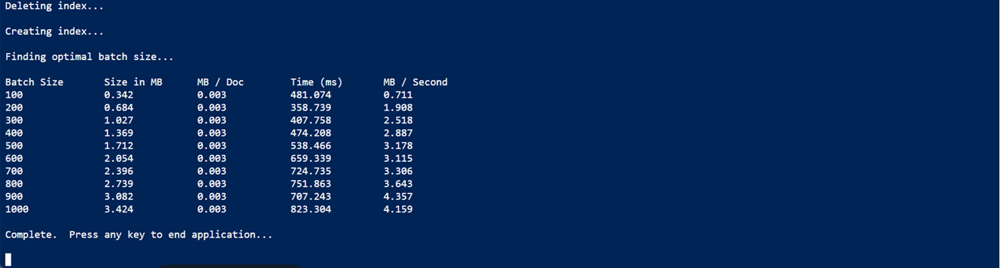

---
lab:
  title: إضافة إلى فهرس باستخدام واجهة برمجة تطبيقات الدفع
---
<style>
  body {
    direction: rtl;
    text-align: right;
    font-family: Arial, sans-serif; /* Ensure Arabic fonts are supported */
  }

  h1, h2, h3, h4, h5, h6 {
    text-align: right;
  }

  p {
    text-align: right;
  }
</style>


# إضافة إلى فهرس باستخدام واجهة برمجة تطبيقات الدفع

تريد استكشاف كيفية إنشاء فهرس بحث الذكاء الاصطناعي في Azure وتحميل المستندات إلى هذا الفهرس باستخدام التعليمات البرمجية C#.

في هذا التمرين، ستستنسخ حل C# موجود وتشغله للعمل على الحجم الأمثل للدُفعة لتحميل المستندات. ثم ستستخدم حجم الدُفعة هذا وتحميل المستندات بفعاليةٍ باستخدام نهج مؤشر ترابط.

> **ملاحظة**: لإكمال هذا التمرين، ستحتاج إلى اشتراك Microsoft Azure. إذا لم يكن لديك اشتراك بالفعل، يمكنك التسجيل للحصول على الإصدار التجريبي على [https://azure.com/free](https://azure.com/free?azure-portal=true) .

## إعداد موارد Azure الخاص بك

لتوفير وقتك، حدد قالب Azure Resource Manager هذا لإنشاء الموارد التي ستحتاج إليها لاحقاً في التمرين:

1. [توزيع الموارد إلى Azure](https://portal.azure.com/#create/Microsoft.Template/uri/https%3A%2F%2Fraw.githubusercontent.com%2FMicrosoftLearning%2Fmslearn-knowledge-mining%2Fmain%2FLabfiles%2F07-exercise-add-to-index-use-push-api%20lab-files%2Fazuredeploy.json) - حدد هذا الارتباط لإنشاء موارد الذكاء الاصطناعي في Azure.
    
1. في **Resource group**، حدد **Create new**، وبادر بتسميته **cog-search-language-exe**.
1. في **Region**، حدد [supported region](/azure/ai-services/language-service/custom-text-classification/service-limits#regional-availability) القريبة من منطقتك.
1. يجب أن تكون **بادئة المورد** فريدة بشكل عام، أدخل بادئة حرف رقمية وأحرف صغيرة عشوائية، على سبيل المثال، **acs118245**.
1. في **Location**، حدد نفس المنطقة التي اخترتها أعلاه.
1. حدد "**Review + create**".
1. حدد **إنشاء**.
1. عند انتهاء النشر، حدد **الانتقال إلى مجموعة الموارد** لرؤية كافة الموارد التي أنشأتها.

    

## نسخ معلومات واجهة برمجة تطبيقات REST الخاصة بخدمة بحث الذكاء الاصطناعي في Azure

1. في قائمة الموارد، حدد خدمة البحث التي أنشأتها. في المثال أعلاه **acs118245-search-service**.
1. انسخ اسم خدمة البحث في ملف نصي.

    
1. على اليسار، حدد **Keys**، ثم انسخ **مفتاح المسؤول الأساسي** في نفس الملف النصي.

## تنزيل مثال التعليمات البرمجية لاستخدامه في Visual Studio Code

ستقوم بتشغيل نموذج التعليمات البرمجية Azure باستخدام Visual Studio Code. تم توفير ملفات التعليمات البرمجية لتطبيقك في مخزن بيانات خاصة بـ GitHub.

1. ابدأ تشغيل Visual Studio Code.
1. افتح لوحة (SHIFT+CTRL+P) وشغّل **Git: استنسخ الأمر ** لاستنساخ مستودع `https://github.com/MicrosoftLearning/mslearn-knowledge-mining` إلى مجلد محلي (لا يُهم أي مجلد).
1. عند استنساخ المستودع، افتح المجلد في تعليمة Visual Studio البرمجية.
1. انتظر حتى تثبيت ملفات إضافية لدعم مشاريع التعليمات البرمجية C# في المستودع.

    > **ملاحظة**: إذا جرت مطالبتك بإضافة الأصول المطلوبة للبناء وتصحيح الأخطاء، فحدد **ليس الآن**.

1. في شريط التنقل على اليسار، وسّع المجلد **optimize-data-indexing/v11/OptimizeDataIndexing**، ثم حدد الملف **appsettings.json**.

    
1. الصق اسم خدمة البحث ومفتاح المسؤول الأساسي لديك.

    ```json
    {
      "SearchServiceUri": "https://acs118245-search-service.search.windows.net",
      "SearchServiceAdminApiKey": "YOUR_SEARCH_SERVICE_KEY",
      "SearchIndexName": "optimize-indexing"
    }
    ```

    يجب أن يبدو ملف الإعدادات مشابهاً لما هو موضح أعلاه.
1. احفظ التغييرات بالنقر فوق **CTRL+S**.
1. انقر بزر الماوس الأيمن فوق المجلد **OptimizeDataIndexing** وحدد **فتح في الوحدة الطرفية المتكاملة**.
1. في الوحدة الطرفية، أدخل `dotnet run` واضغط على **Enter**.

    
يوضح الإخراج أنه في هذه الحالة، يكون حجم الدُفعة الأفضل أداءً هو 900 مستند. حيث يصل إلى 6.071 ميجا بايت في الثانية.

## تحرير التعليمات البرمجية لتنفيذ مؤشر الترابط واستراتيجية التراجع وإعادة المحاولة

هناك تعليمة برمجية تم تعطيلها بالتحويل إلى تعليق وهي جاهزة لتغيير التطبيق لاستخدام مؤشرات الترابط لتحميل المستندات إلى فهرس البحث.

1. تأكد من تحديد **Program.cs**.

    
1. علق على السطرين 37 و 38 على هذا النحو:

    ```csharp
    //Console.WriteLine("{0}", "Finding optimal batch size...\n");
    //await TestBatchSizesAsync(searchClient, numTries: 3);
    ```

1. إلغاء التعليق على الأسطر 44 إلى 48.

    ```csharp
    Console.WriteLine("{0}", "Uploading using exponential backoff...\n");
    await ExponentialBackoff.IndexDataAsync(searchClient, hotels, 1000, 8);

    Console.WriteLine("{0}", "Validating all data was indexed...\n");
    await ValidateIndexAsync(indexClient, indexName, numDocuments);
    ```

    التعليمات البرمجية التي تتحكم في حجم الدُفعة وعدد مؤشرات الترابط هي `await ExponentialBackoff.IndexDataAsync(searchClient, hotels, 1000, 8)`. حجم الدُفعة هو 1000 ومؤشرات الترابط ثمانية.

    
    ينبغي أن تبدو تعليماتك البرمجية كما هو موضح أعلاه.

1. لحفظ تغييراتك، اضغط على **CTRL**+**S**.
1. حدد المحطة الطرفية، ثم اضغط على أي مفتاح لإنهاء عملية التشغيل إذا لم تكن قد نفذت ذلك بالفعل.
1. شغّل `dotnet run` في المحطة.

    سيبدأ التطبيق ثمانية مؤشرات ترابط، ثم مع انتهاء كل مؤشر ترابط من كتابة رسالة جديدة إلى وحدة التحكم:

    ```powershell
    Finished a thread, kicking off another...
    Sending a batch of 1000 docs starting with doc 57000...
    ```

    بعد تحميل 100,000 مستند، يكتب التطبيق ملخصاً (قد يستغرق هذا بعض الوقت ليكتمل):

    ```powershell
    Ended at: 9/1/2023 3:25:36 PM
    
    Upload time total: 00:01:18:0220862
    Upload time per batch: 780.2209 ms
    Upload time per document: 0.7802 ms
    
    Validating all data was indexed...
    
    Waiting for service statistics to update...
    
    Document Count is 100000
    
    Waiting for service statistics to update...
    
    Index Statistics: Document Count is 100000
    Index Statistics: Storage Size is 71453102
    
    ``````

استكشف التعليمات البرمجية في الإجراء `TestBatchSizesAsync` لمعرفة كيفية اختبار التعليمات البرمجية لأداء حجم الدُفعة.

استكشف التعليمات البرمجية في الإجراء `IndexDataAsync` لمعرفة كيفية إدارة التعليمات البرمجية لمؤشرات الترابط.

استكشف التعليمات البرمجية في `ExponentialBackoffAsync` لمعرفة كيفية تنفيذ التعليمات البرمجية لاستراتيجية إعادة محاولة التراجع المطرد.

يمكنك البحث والتحقق من إضافة المستندات إلى الفهرس في مدخل Azure.


## التنظيف

الآن بعد أن أكملت التمرين، احذف جميع الموارد التي لم تعد بحاجة إليها. ابدأ بالتعليمة البرمجية المستنسخة إلى جهازك. ثم احذف موارد Azure.

1. في **مدخل Azure**، حدد "Resource groups".
1. حدد مجموعة الموارد التي أنشأتها لهذا التمرين.
1. حدد **Delete resource group**. 
1. أكد الحذف ثم حدد **حذف**.
1. حدد الموارد التي لا تحتاج إليها، ثم حدد **Delete**.
