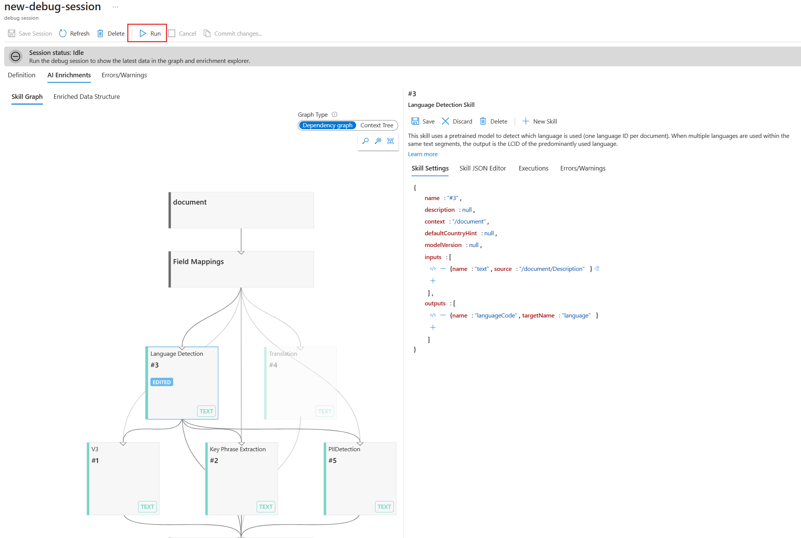

---
lab:
  title: تصحيح مشكلات البحث
---

# تصحيح مشكلات البحث

لقد أنشأت حل البحث الخاص بك ولكنك لاحظت أن هناك بعض التحذيرات على المفهرس.

في هذا التمرين، ستنشئ حل بحث الذكاء الاصطناعي في Azure واستيراد بعض نماذج البيانات، ثم حل تحذير على المفهرس.

> **ملاحظة**: لإكمال هذا التمرين، ستحتاج إلى اشتراك Microsoft Azure. إذا لم يكن لديك اشتراك بالفعل، يمكنك التسجيل للحصول على الإصدار التجريبي على [https://azure.com/free](https://azure.com/free?azure-portal=true) .

## إنشاء حل البحث الخاص بك

قبل أن تتمكن من البدء في استخدام جلسة تصحيح الأخطاء، تحتاج إلى إنشاء خدمة Azure Cognitive Search.

1. [توزيع الموارد إلى Azure](https://portal.azure.com/#create/Microsoft.Template/uri/https%3A%2F%2Fraw.githubusercontent.com%2FAzure-Samples%2Fazure-search-knowledge-mining%2Fmain%2Fazuredeploy.json) - حدد هذا الارتباط لتوزيع جميع الموارد التي تحتاجها في مدخل Microsoft Azure.

    

1. ضمن ⁧**⁩Resource group⁦⁩⁧**⁩، حدد ⁧**⁩Create new⁧**⁩.
1. اكتب **acs-cognitive-search-exercise**.
1. حدد أقرب **Region** لك.
1. بالنسبة إلى **بادئة الموارد**، أدخل **acslearnex** وأضف مجموعة عشوائية من الأرقام أو الأحرف للتأكد من أن اسم التخزين فريد.
1. بالنسبة إلى الموقع، حدد نفس المنطقة التي استخدمتها أعلاه.
1. في جزء التنقل السفلي، حدد **Review + create**.
1. انتظر حتى يتم توزيع الموارد، ثم حدد **Go to resource group**.

## استيراد بيانات العينة

باستخدام الموارد التي تم إنشاؤها، يمكنك الآن استيراد بيانات المصدر الخاص بك.

1. في الموارد المدرجة، حدد خدمة البحث.

1. ثم، في جزء **Overview** حدد **Import data**.

      

1. في جزء استيراد البيانات، لمصدر البيانات، حدد **Samples**.

      

1. في قائمة العينات، حدد **hotels-sample**.
1. حدد **Next:Add cognitive skills (Optional)**.
1. قم بتوسيع القسم **Add enrichments**.

    

1. حدد **Text Cognitive Skills**.
1. حدد **Next:Customize target index**.
1. اترك الإعدادات الافتراضية، ثم حدد **Next:Create an indexer**.
1. حدد **إرسال**.

## استخدام جلسة تصحيح الأخطاء لحل التحذيرات على المفهرس الخاص بك

سيبدأ المفهرس الآن في استيعاب 50 مستنداً. مع ذلك، إذا تحققت من حالة المفهرس، فستجد أن هناك تحذيرات.

1. حدد **جلسات تتبع الأخطاء** في الجزء الأيمن.

1. حدد **+ إضافة جلسة تتبع الأخطاء**.

1. حدد **اختيار اتصال موجود** لسلسلة اتصال التخزين، ثم حدد حساب التخزين الخاص بك.

    
1. حدد **+ حاوية** لإضافة حاوية جديدة. يمكنك تسميتها **acs-debug-storage**.

    

1. يمكن تعيين **مستوى الوصول المجهول** الخاص به إلى حاوية ** (وصول مجهول للقراءة للحاويات والكائنات الثنائية كبيرة الحجم)**.

    > **ملاحظة**: قد تحتاج إلى تمكين الكائن الثنائي كبير الحجم المجهول لتحديد هذا الخيار. لتنفيذ ذلك، في حساب التخزين انتقل إلى **التكوين** ، واضبط **السماح بالوصول المجهول للكائن الثنائي كبير الحجم** إلى **مُمكَّن** ثم حدد **حفظ**.

1. حدد **إنشاء**.
1. حدد الحاوية الجديدة في القائمة، ثم اختر **تحديد**.
1. حدد **hotel-sample-indexer** **لقالب المفهرس**.
1. حدد **Save Session**.

    يوضح لك مخطط التبعية أنه لكل مستند هناك خطأ على ثلاث مهارات.
    

1. حدد **V3**.
1. في جزء تفاصيل المهارات، حدد **Errors/Warnings(1)**.
1. قم بتوسيع عمود **Message** حتى تتمكن من رؤية التفاصيل.

    التفاصيل هي:

    *رمز اللغة غير صالح '(غير معروف)'. اللغات المدعومة: ar,cs,da,de,en,es,fi,fr,hu,it,ja,ko,nl,no,pl,pt-BR,pt-PT,ru,sv,tr,zh-Hans. للحصول على تفاصيل إضافية، انظر https://aka.ms/language-service/language-support.*

    إذا نظرت إلى مخطط التبعية، فإن مهارة الكشف عن اللغة لها مخرجات للمهارات الثلاث مع تحذيرات. أيضاً إدخال المهارة الذي يسبب الخطأ هو `languageCode`.

1. في مخطط التبعية، حدد **Language detection**.

    
    بالنظر إلى إعدادات المهارة JSON، لاحظ أن الحقل المستخدم لاستدلال اللغة هو `HotelId`.

    سيتسبب هذا الحقل في الخطأ حيث لا يمكن للمهارة العمل على اللغة استناداً إلى معرف.

## حل التحذير على المفهرس

1. حدد **المصدر** ضمن الإدخالات، وغيِّر الحقل إلى `/document/Description`.
    
1. حدد **حفظ**.
1. حدد **تشغيل**.

    

    يجب ألا يكون لدى المفهرس أي تحذيرات بعد الآن. يمكن الآن تحديث مجموعة المهارات.

1. حدد **Commit changes...**

    
1. حدد **موافق**.

1. الآن تحتاج إلى التأكد من إرفاق مجموعة المهارات الخاصة بك بمورد خدمات بحث الذكاء الاصطناعي في Azure وإلا فستحصل على عرض الأسعار الأساسي وسيحصل المفهرس على مهلة. لتنفيذ ذلك، حدد **مجموعات المهارات** في الجزء الأيمن، ثم حدد مجموعة **hotels-sample-skillset**.

    
1. حدد **توصيل خدمة الذكاء الاصطناعي** ثم حدد مورد خدمات الذكاء الاصطناعي في القائمة.

    
1. حدد **حفظ**.

1. الآن عليك تشغيل المفهرس لتحديث المستندات بإثراء الذكاء الاصطناعي الثابت. لتنفيذ ذلك، حدد **مفهرسات** في الجزء الأيمن، وحدد  **hotels-sample-indexer**، ثم حدد **تشغيل**.  عند الانتهاء من التشغيل، يجب أن ترى أن التحذيرات الآن صفر.

    

### التنظيف

 لقد أكملت الآن التمرين، إذا انتهيت من استكشاف خدمات بحث الذكاء الاصطناعي في Azure، فاحذف موارد Azure التي أنشأتها خلال التمرين. أسهل طريقة للقيام بذلك هي حذف مجموعة موارد **acs-cognitive-search-exercise**.
